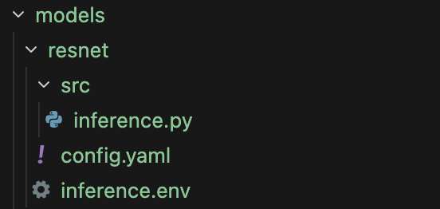
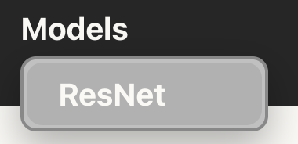
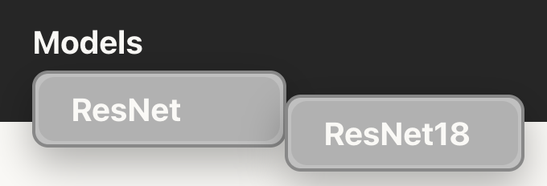
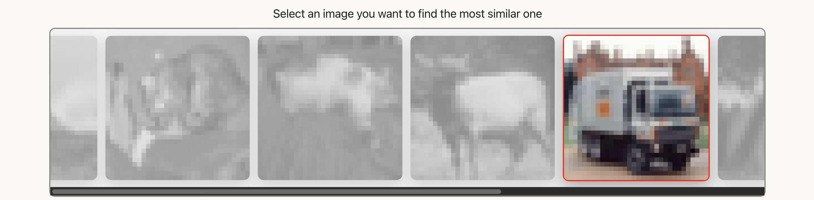
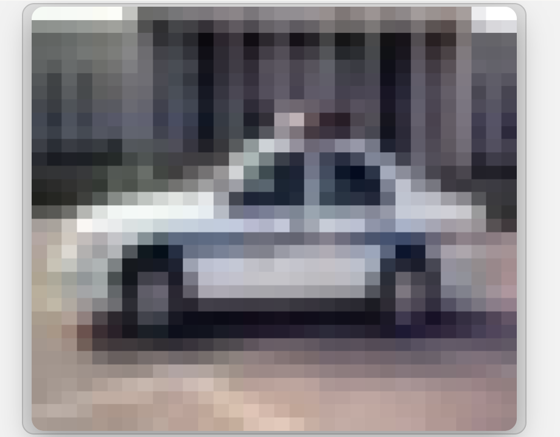

# Getting Started : add a model

This is the easiest way to add a model

We'll add the model resnet18 to perform the taks : find the similar image from an image

## Step 1 : create your folder

create a new folder in models directory named with the name of your model.

Here : resnet



## Step 2 : add your code

 - **Create a `src` folder in your model folder**. It will contain all your python code
 - **Create a file `inference.py`**. It will load/run your model.

## Step 3 : ⚠️ **Constraint about `inference.py`**
All your code must be in a `class` named `inference` which inherits from `InferenceBase`
```python
from worker.template.inference_base import InferenceBase

class Inference(InferenceBase):
    def __init__(self, size_id: str):
        self.size_id = size_id
```
The different size `size_id` of the model will be defined in the file config.yaml. If you have different model size (in case of resnet, we have resnet18, resnet34, resnet50, etc...), it let you know which model you have to load.

In the `def __init__(self, size_id: str):`, prepare you model for the inference
```python
def __init__(self, size_id: str):
    self.size_id = size_id
    ...
    # Load model
    self.model = models.resnet18(weights=models.ResNet18_Weights.DEFAULT)
    ...
```

You must create a function `def infer(self, data, task_id: str):`. It will run the model for a certain task_id. As in our example, we have only one task, we don't need to use task_id. data is just the data you will plan to send to your model. In the case of resnet, we just send a tensor of shape (3, 32, 32) corresponding to the selected image by the user

```python
def infer(self, item, task_id: str):
    input = item.to(self.device)
    input = input.unsqueeze(0)
    embedding = self._embed(input)
    sim = F.cosine_similarity(embedding, self.embeddings_trch, dim=1)
    similar_object = sim.argsort()[-2]
    return self.subset[similar_object]["image"]
```

## Step 4 : create a file `inference.env`

This file contain the variable `VENV_PATH` and you have to set this varibale with the path of virtual environment which can run your file `inference.py`.

In your case :
`VENV_PATH=/path/to/venv`

## Step 5 : create a file `config.yaml`

This is the most import file. Here we define 6 obligatory objects config

### model
Here you must define the name of your model and an id (identifier)

```yaml
model:
  id: resnet
  name: ResNet
```
⚠️
 - The `id` must be the same as the `folder name`
 - The name is displayed on the webpage



### sizes
Here you define the diffenrent sizes of your model

```yaml
sizes:
  - id: resnet18
    name: ResNet18
```

⚠️
 - The size `id` allow to generate n servers to inference in parallel all the diff sizes
 - The size name is displayed on the webpage to let the user choose among the different sizes



### data_types
Data types allow to automatically connect all elements of the server

```yaml
data_types:
  - id: tensor
    kind: tensor
    representation: torch_tensor
    shape: [C, H, W]

  - id: image
    kind: image
    representation: matplotlib_figure

  - id: subset-cifar10-dict
    kind: dictionary
    fields:
      - id: tensor
        data_type_id: tensor
      - id: image
        data_type_id: image

  - id: subset-cifar10-dict-list
    kind: list
    element_type:
      data_type_id: subset-cifar10-dict
```

### datasets

All the data processing is not done on the inference server but on the media service server, so you need to define in `datasets` :
 - `path` : the path to you dataset
 - `checkpoint_format` : The type of file you dataset has been saved (.pt, .pkl, .hdf5, etc...)
 - `data_type_id` : describe the data type

```yaml
datasets:
  - id: subset-cifar10
    name: Subset CIFAR-10
    path: "path/to/your/dataset.pkl"
    checkpoint_format: pickle
    data_type_id: subset-cifar10-dict-list
```

### modalities

modality is the type of visual available on the webpage

```yaml
modalities:
  - id: image
    name: RGB Image
    data_type_id: image
```

### tasks
For each task (can be only one), you must define an `id` and `name`
```yaml
tasks:
  - id: image-similarity
    name: Image Similarity
```

Define the id of the modality to render the random samples

```yaml 
    data_samples:
      modality_id: image
```
Define the id of the modality to render the inference result

```yaml 
    data_outputs:
      modality_id: image
```

Even if the webpage automatically adapt to the previous parameters, there are still a few to set in `ui`:
 - `text_top_screen` : Ask to select an image and discribe 
```yaml 
    ui:
      text_top_screen: "Select an image you want to find the most similar one"
      data_size: { width: "25vh", height: "25vh" }
      output_data_size: { width: "40vh", height: "35vh" }
      submit_button_text: "Search Most Similar Image"
```
    inference:
      input_data_type_id: tensor
      output_data_type_id: image
```