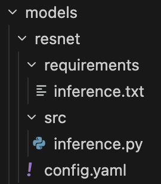
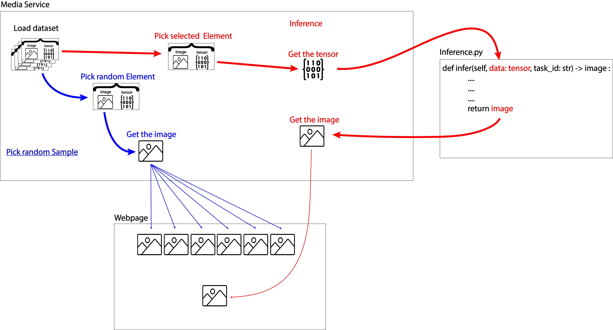
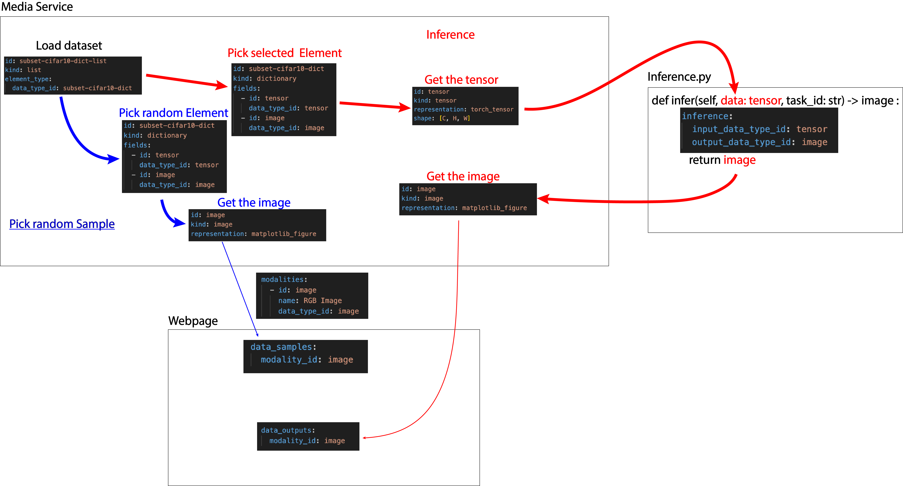

# Getting Started : add a model

This is the easiest way to add a model

We'll add the model resnet18 to perform the task : find the most similar image for an image

## Step 1 / 5 : Create your folder

Create a new folder in `models/` directory named with the name of your model.

🧪 Here : `resnet/`

<p align="center">
  
</p>

## Step 2 / 5 : Add your code

 - **Create a `src/` folder in your model folder**. It will contain all your python code
 - **Create a file `inference.py`**. It will load/run your model.

## Step 3 / 5 : ⚠️ Constraints about `inference.py`

The full file is located in [docs/tutorials/add_a_model_quick_start/src/inference.py](src/inference.py)

### Part 1 / 4 : Use a specific class
All your code must be in a `class` named `Inference` which inherits from `InferenceBase` and must have `def __init__(self, size_id: str):` function.
```python
from worker.template.inference_base import InferenceBase

class Inference(InferenceBase):
    def __init__(self, size_id: str):
        self.size_id = size_id
        ...
```
ℹ️ `size_id` will be useful in a more advanced tutorial.

---

### Part 2 / 4 : Prepare your model

In the `__init__(...):`, prepare you model for the inference :
 - Set devices
 - Load the model
 - Move to GPU
 - ...
```python
def __init__(self, size_id: str):
    self.size_id = size_id
    ...
    # Load model
    model = models.resnet18(weights=None)
    model.load_state_dict(torch.load("/data/weights/resnet/resnet18/resnet18.pth"))
    model.fc = nn.Identity()
    model.eval()
    self.model = model.to(self.device)
    ...
```

---

### Part 3 / 4 : ⚠️ Define mounted paths

ℹ️ All paths are mounted so you can't use the same one. The system only keep the file or the last folder :
 - datasets are located in `/data/datasets/<your-model-name>/`
 - models are located in `/data/weights/<your-model-name>/<your-model-size>/`

🧪 About resnet exemple :
 - `path/to/your/dataset/data.pkl` --> `/data/datasets/resnet/data.pkl`
 - `path/to/your/model/resnet18.pth` --> `/data/weights/resnet/resnet18/resnet18.pth`

---

### Part 4 / 4 : Prepare your inference function

You must create a function `def infer(self, data, task_id: str):`

```python
def infer(self, data, task_id: str):
    ...
    # Run model
    output = self.model(input)
    ...
    return output
```

ℹ️ It will run the model for a certain task_id.

ℹ️ `data` will be defined in `config.yaml` and can be everything (tensor, dictionnary, list, etc...)

🧪 As in our example, we have only one task, we don't need to use task_id.

🧪 In the case of resnet, `data` is a `tensor` of shape `(3, 32, 32)` corresponding to the selected image by the user.

## Step 4 / 5 : Create the python environment

In your directory, create a new folder named `requirements` and add the required libraries used by `inference.py` in a new file `inference.txt`.

🧪 In the case of resnet :
```yaml
torch
torchvision
matplotlib
```

## Step 5 / 5 : ⚠️ most important : Create the file `config.yaml`

This file configure everything. Here we define 6 obligatory objects config.

The full file is located in [docs/tutorials/add_a_model_quick_start/src/config.yaml](src/config.yaml)

---

### Part 1 / 6 : model
Here you must define the name of your model and an id (identifier)

```yaml
model:
  id: resnet
  name: ResNet
```
⚠️ The `id` must be the same as `<your-model's-folder's-name>` in `models/`

ℹ️ The `name` is displayed on the webpage

<p align="center">
  
</p>

---

### Part 2 / 6 : sizes
Here you define the diffenrent sizes of your model

```yaml
sizes:
  - id: resnet18
    name: ResNet18
```

ℹ️ The size name is displayed on the webpage to let the user choose among the different sizes.

<p align="center">
  
</p>

---

### Part 3 / 6 : data_types
Data types allow to automatically connect all elements in between each other in the server.

```yaml
data_types:
  - id: tensor
    kind: tensor
    representation: torch_tensor
    shape: [C, H, W]

  - id: image
    kind: image
    representation: matplotlib_figure

  - id: subset-cifar10-dict
    kind: dictionary
    fields:
      - id: tensor
        data_type_id: tensor
      - id: image
        data_type_id: image

  - id: subset-cifar10-dict-list
    kind: list
    element_type:
      data_type_id: subset-cifar10-dict
```

Here is a map representation to show how to define its data pipelines.



And its hard-coded version.



---

### Part 4 / 6 : datasets

Most of the data processing is done on the [Media Service micro-service (ℹ️) ](server_architecture.md), so a class  `datasets` has to define and contains :
 - `path` : the path to the dataset on your machine
 - `checkpoint_format` : The type of file your dataset has been saved with (.pt, .pkl, .hdf5, etc...)
 - `data_type_id` : describe the data type

```yaml
datasets:
  - id: subset-cifar10
    name: Subset CIFAR-10
    path: "path/to/your/dataset.pkl"
    checkpoint_format: pickle
    data_type_id: subset-cifar10-dict-list
```

---

### Part 5 / 6 : modalities

ℹ️ modality define the type of visual you want to display on the webpage

```yaml
modalities:
  - id: image
    name: RGB Image
    data_type_id: image
```

---

### Part 6 / 6 : tasks

For each task, you must define an `id` and `name`
```yaml
tasks:
  - id: image-similarity
    name: Image Similarity
```

---

Define the id of the modality you want to use to render the random samples.

```yaml 
    data_samples:
      modality_id: image
```


---

Define the id of the modality you want to use to render the inference result.

<p align="center">
  
</p>

```yaml 
    data_outputs:
      modality_id: image
```

---

A few `UI` parameters has to set :
 - `text_top_screen` : Ask to select an image and describe the task
 - `data_size` : Size of the random images (using `css`)
 - `output_data_size` : Size of the inference ouput images (using `css`)
```yaml 
    ui:
      text_top_screen: "Select an image you want to find the most similar one"
      data_size: { width: "25vh", height: "25vh" }
      output_data_size: { width: "40vh", height: "35vh" }
      submit_button_text: "Search Most Similar Image"
```

---

Related to the section [Prepare your inference function](Part-4-/-4-:-Prepare-your-inference-function), using the defined data types, you have to define :
 - what's the data type of `data`, the input of `infer()`
 - what does `infer()` return

```yaml 
    inference:
      input_data_type_id: tensor
      output_data_type_id: image
```

🧪 In the case of resnet :
 - the input is a tensor (3, 32, 32) representing a RGB image
 - the output is a Matplotlib image

---

Congrats!!!

<p align="center">
  
</p>

You have reached the end of the quick started tutorial 